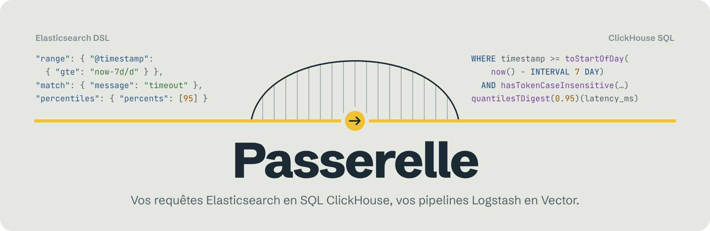
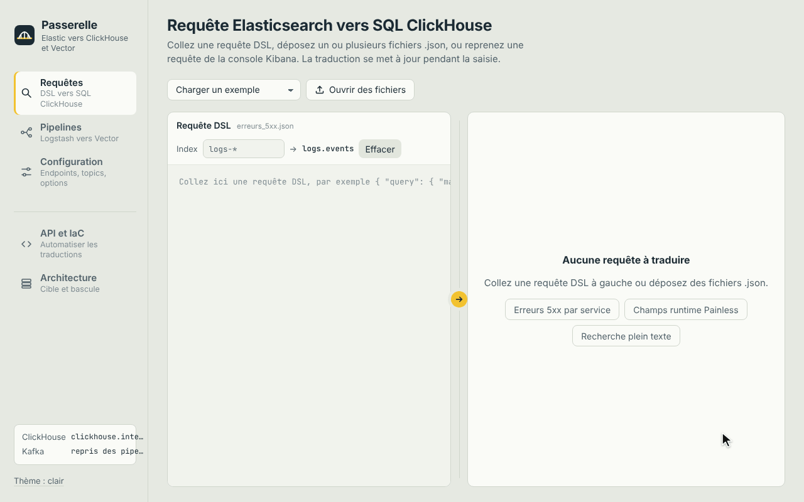
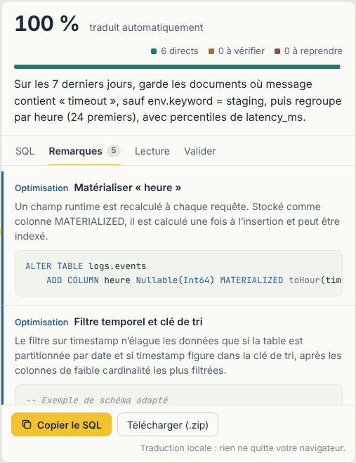
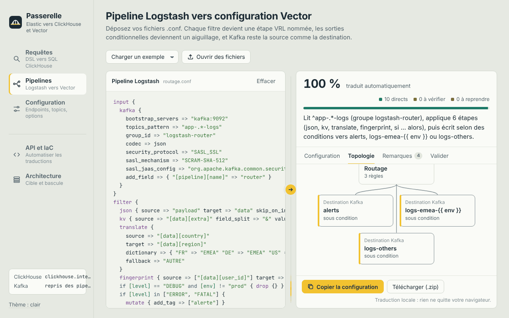

<p align="center">
  <picture>
    <source media="(prefers-color-scheme: dark)" srcset="docs/assets/banner-dark.png">
    
  </picture>
</p>

<p align="center">
  <b>Déposez une requête Elasticsearch ou un pipeline Logstash.<br>
  Passerelle écrit le SQL ClickHouse ou la configuration Vector, l’explique en français et vous montre exactement où regarder.</b>
</p>

<p align="center">
  <a href="https://github.com/OlivMartins/passerelle/releases/latest"></a>
  <a href="https://github.com/OlivMartins/passerelle/actions/workflows/ci.yml"></a>
  <a href="LICENSE"></a>
  
  
  
</p>

<p align="center">
  <a href="https://github.com/OlivMartins/passerelle/releases/latest/download/passerelle.html"><b>Essayer dans le navigateur</b></a>
  &nbsp;&nbsp;|&nbsp;&nbsp;
  <a href="#sur-un-serveur-linux"><b>Installer sur un serveur</b></a>
  &nbsp;&nbsp;|&nbsp;&nbsp;
  <a href="docs/INSTALL.md"><b>Guide complet</b></a>
</p>

<br>

<picture>
  <source media="(prefers-color-scheme: dark)" srcset="docs/assets/demo-dark.gif">
  
</picture>

<br>

## Migrer sans tout réécrire

Quitter Elasticsearch pour ClickHouse, c’est hériter de centaines de requêtes cachées dans les tableaux de bord, les alertes et les scripts, et de dizaines de pipelines Logstash patiemment ajustés. Les réécrire à la main demande une double expertise, prend des semaines et fait courir un risque à chaque ligne.

Passerelle fait ce travail à votre place, fichier par fichier, et rend chaque décision lisible.

<table>
<tr>
<td width="33%" valign="top">

**Il traduit**

Un SQL ClickHouse idiomatique et des configurations Vector typées, produits en quelques millisecondes, y compris les champs runtime Painless et les filtres grok.

</td>
<td width="33%" valign="top">

**Il explique**

Un taux de couverture, un résumé en français et des remarques classées : à reprendre, à vérifier, optimisation. Chacun sait où porter son attention.

</td>
<td width="33%" valign="top">

**Il vérifie**

L’API soumet le SQL à `EXPLAIN` sur votre ClickHouse et compile la configuration avec `vector validate`, pour ne rien envoyer en production à l’aveugle.

</td>
</tr>
</table>

## Avant, après

Une requête typique de tableau de bord, avec un champ runtime Painless. Le SQL qui suit est la sortie réelle de Passerelle, sans retouche.

**Ce que vous déposez :**

```json
{
  "size": 0,
  "runtime_mappings": {
    "heure": { "type": "long", "script": "emit(doc['@timestamp'].value.getHour())" }
  },
  "query": { "bool": {
    "filter": [
      { "range": { "@timestamp": { "gte": "now-7d/d" } } },
      { "match": { "message": "timeout" } }
    ],
    "must_not": [ { "term": { "env.keyword": "staging" } } ]
  } },
  "aggs": {
    "par_heure": {
      "terms": { "field": "heure", "size": 24 },
      "aggs": { "p95": { "percentiles": { "field": "latency_ms", "percents": [95] } } }
    }
  }
}
```

**Ce que Passerelle produit :**

```sql
WITH
    toHour(timestamp, 'UTC') AS heure
SELECT
    heure AS par_heure,
    count() AS doc_count,
    quantilesTDigest(0.95)(latency_ms) AS p95
FROM logs.events
WHERE timestamp >= toStartOfDay(now('UTC') - INTERVAL 7 DAY)
  AND hasTokenCaseInsensitive(message, 'timeout')
  AND env != 'staging'
  AND isNotNull(heure)
GROUP BY par_heure
ORDER BY doc_count DESC, par_heure ASC
LIMIT 24;
```

Le script Painless devient une expression `WITH`. Le `match` plein texte devient une recherche par tokens, qu’un index peut accélérer. Le percentile garde l’algorithme t-digest d’Elasticsearch, donc des résultats comparables.

Les dates sont calculées en UTC, comme dans Elasticsearch, quel que soit le fuseau du serveur ClickHouse : c’est le rôle des `'UTC'` du SQL. Si votre serveur et vos colonnes sont déjà en UTC, déclarez `timezone: UTC` dans la configuration et le SQL s’en passe.

Passerelle signale aussi que `heure` gagnerait à être une colonne matérialisée et que `message` mérite un index `tokenbf_v1`. Le `ALTER TABLE` correspondant est prêt à copier.

## Une lecture pour chacun

<table>
<tr>
<td width="50%" valign="top">

**Pour décider.** Chaque traduction annonce son taux de couverture et se résume en une phrase en français : période, filtres, regroupements, mesures. Un chef de projet sait en dix secondes ce que fait une requête et si elle est prête.

</td>
<td width="50%" valign="top">

**Pour les experts.** Les remarques détaillent chaque choix et proposent le DDL d’optimisation : colonnes matérialisées, index de saut, clé de tri, `LowCardinality`. Le SQL exploite ce que ClickHouse fait de mieux : `LIMIT n BY`, `WITH FILL`, combinateurs `-If`, fonctions fenêtrées.

</td>
</tr>
<tr>
<td valign="top">

<picture>
  <source media="(prefers-color-scheme: dark)" srcset="docs/assets/lecture-dark.png">
  
</picture>

</td>
<td valign="top">

<picture>
  <source media="(prefers-color-scheme: dark)" srcset="docs/assets/remarques-dark.png">
  
</picture>

</td>
</tr>
</table>

## Logstash vers Vector, Kafka compris

<picture>
  <source media="(prefers-color-scheme: dark)" srcset="docs/assets/pipelines-dark.png">
  
</picture>

- **Chaque filtre devient une étape VRL nommée** : grok, dissect, date, mutate, json, kv, geoip, translate, fingerprint, et neuf autres. Le code est typé selon les règles du compilateur VRL : aucune erreur ignorée en silence.
- **Les sorties conditionnelles deviennent un aiguillage** `route`, avec une destination par branche.
- **Kafka reste au cœur du flux** : mêmes topics, groupe de consommateurs, SASL et TLS. Les identifiants sont référencés par des variables d’environnement plutôt qu’écrits en clair.
- **Rien ne change pour les consommateurs** : `@timestamp`, `@version` et le format de date de Logstash sont reproduits.
- **Bascule sans risque** : en mode shadow, Vector lit avec son propre groupe et écrit dans des topics `-shadow`, à côté de Logstash, le temps de comparer.

<details>
<summary><b>Voir un pipeline traduit</b></summary>

<br>

```ruby
filter {
  grok {
    match => { "message" => "%{IP:ip} %{WORD:verbe} %{NUMBER:statut:int}" }
  }
  if [statut] >= 500 {
    mutate { add_tag => ["erreur"] }
  }
}
```

devient (extrait de la configuration générée) :

```yaml
transforms:
  grok:
    type: remap
    inputs: [kafka_in_init]
    source: |
      # grok
      parsed, err = parse_grok(.message, s'%{IP:ip} %{WORD:verbe} %{NUMBER:statut}')
      if err == null {
        . = merge(object!(.), parsed)
        .statut = to_int(.statut) ?? .statut
      } else {
        .tags = compact(flatten([.tags, "_grokparsefailure"]))
      }
  condition_2:
    type: remap
    inputs: [grok]
    source: |
      if (to_float(.statut) ?? 0.0) >= 500 {
        # mutate
        .tags = compact(flatten([.tags, "erreur"]))
      }
```

</details>

## Une configuration, versionnée avec votre code

Un seul fichier décrit votre plateforme cible. L’interface, l’API et la ligne de commande le lisent de la même façon : il se range dans Git, à côté des requêtes et des pipelines qu’il sert à traduire.

```yaml
clickhouse:
  endpoint: https://clickhouse.internal:8443
  user: '${CLICKHOUSE_USER}'          # secrets résolus au déploiement
  password: '${CLICKHOUSE_PASSWORD}'
  text_fields: [message, error.message]
  index_mapping:
    'logs-*': logs.events             # index Elasticsearch → table ClickHouse
  field_mapping:
    '@timestamp': timestamp
  columns:                            # types des colonnes : facultatif, mais nécessaire à une traduction fidèle
    env: LowCardinality(Nullable(String))
    tags: Array(String)
    latency_ms: UInt32
kafka:
  bootstrap_servers: kafka-1:9092,kafka-2:9092
  consumer_group: vector-logs
vector:
  acknowledgements: true              # offsets validés après écriture seulement
  shadow_mode: false
```

### Donnez-lui le schéma de vos colonnes

Elasticsearch et ClickHouse ne répondent pas pareil dès qu’un champ est facultatif, multivalué ou entier. `columns` indique à Passerelle le type de chaque colonne, et la traduction s’adapte :

| Colonne | Ce que Passerelle écrit |
|---|---|
| `Nullable` | Un `must_not` garde les lignes `NULL`, comme Elasticsearch garde les documents sans le champ : `(env != 'staging' OR env IS NULL)`. Un regroupement les écarte. |
| `Array` | Un champ multivalué : `has(tags, 'a')` pour un `term`, `arrayJoin(tags)` pour un regroupement, `notEmpty(tags)` pour `exists`. |
| Entier | La division de deux entiers d’un script Painless devient `intDiv()`, entière comme en Java. |
| Date | Une borne numérique est lue comme un instant en epoch millis. |

Une requête suffit à produire ce bloc :

```sql
SELECT concat('    ', name, ': ', type)
FROM system.columns
WHERE database = 'logs' AND table = 'events'
FORMAT TSVRaw
```

Sans `columns`, Passerelle traduit comme si toutes les colonnes étaient simples et non `Nullable`, et le signale par une remarque « à vérifier » sur les requêtes concernées.

Si vos colonnes de texte ne sont pas `Nullable` et qu’une chaîne vide y représente un champ absent, ajoutez `empty_as_missing: true` : `exists` devient `colonne != ''`, et les regroupements ignorent les chaînes vides.

### Listes noires et listes blanches

Un `terms`, une série de `should` sur le même champ (le filtre « est l’un de » de Kibana) ou des `OR` dans une `query_string` sont réunis en un seul `IN`.

Au-delà de 256 Kio, ClickHouse refuse une requête : une liste de quelques dizaines de milliers de valeurs suffit. Fixez un seuil, et les listes plus longues quittent le SQL pour une table :

```yaml
clickhouse:
  lists:
    threshold: 200                    # au-delà de 200 valeurs, la liste devient une table nommée
    names:
      c70cbd66b3c3: robots_connus     # facultatif : un nom lisible pour une empreinte
```

```sql
WHERE host NOT IN (SELECT value FROM logs.passerelle_lists WHERE name = 'robots_connus')
```

Le nom par défaut est l’empreinte du contenu de la liste : la même liste dans trois cents tableaux de bord ne donne qu’une entrée. Passerelle fournit le `CREATE TABLE` et les `INSERT`, dans le champ `lists` de l’API et dans un fichier `.lists.sql` à côté de chaque requête traduite par la CLI.

## Démarrer

### Dans le navigateur, sans rien installer

Téléchargez [`passerelle.html`](https://github.com/OlivMartins/passerelle/releases/latest/download/passerelle.html) et ouvrez-le. L’interface complète fonctionne hors ligne, sans serveur, et rien ne quitte votre poste.

### Sur un serveur Linux

```bash
curl -LO https://github.com/OlivMartins/passerelle/releases/download/v1.0.0/passerelle-1.0.0-linux-x86_64.tar.gz
tar xzf passerelle-1.0.0-linux-x86_64.tar.gz && cd passerelle-1.0.0-linux-x86_64
sudo ./install.sh
```

Un seul binaire, Node.js embarqué, aucune dépendance à installer. Le service systemd démarre sur `127.0.0.1:8080`, avec une API protégée par un jeton généré à l’installation. Il faut une distribution Linux x86_64 récente (glibc 2.28+ : RHEL 8, Debian 10, Ubuntu 20.04 ou plus récent). Configuration, reverse proxy, mise à jour : tout est dans le [guide d’installation](docs/INSTALL.md).

### Dans votre intégration continue

```bash
# Traduit des dossiers entiers ; code de sortie 2 si un élément reste à reprendre
passerelle dsl2sql   requetes/  --config passerelle.yaml --out build/sql    --fail-on todo
passerelle ls2vector pipelines/ --config passerelle.yaml --out build/vector --fail-on todo

# Ou à la demande, par l’API REST
curl -sS -X POST "http://127.0.0.1:8080/v1/translate/dsl?index=logs-*" \
  -H "Authorization: Bearer $PASSERELLE_TOKEN" --data-binary @requete.json | jq -r .sql
```

| Route | Rôle |
|---|---|
| `POST /v1/translate/dsl` | Requête DSL (JSON ou format console Kibana) vers SQL, avec remarques et couverture |
| `POST /v1/translate/logstash` | Pipeline `.conf` vers configuration Vector, en YAML ou TOML |
| `POST /v1/validate/sql` | `EXPLAIN indexes = 1` sur votre ClickHouse, en lecture seule |
| `POST /v1/validate/vector` | Compilation complète de la configuration et du VRL par `vector validate` |

## Sécurité et confidentialité

- **Vos requêtes restent chez vous.** L’interface traduit dans le navigateur, hors ligne, sans police ni script externe ni télémétrie.
- **Service durci.** Utilisateur dédié sans privilège, système de fichiers en lecture seule, filtre seccomp vérifié sur les appels système réellement utilisés. Score `systemd-analyze security` : 1.2, « OK ».
- **API sobre.** Jeton comparé en temps constant, politique CSP stricte, corps limités à 2 Mio. La validation SQL n’accepte qu’un `SELECT`, exécuté en `readonly`.
- **Secrets hors des fichiers.** Par défaut, les mots de passe sont des références `${VARIABLE}`, aussi bien dans la configuration de Passerelle que dans les configurations Vector qu’il génère.

Une faille à signaler ? Suivez la [politique de sécurité](SECURITY.md).

## Ce que Passerelle sait traduire

**28** types de requêtes, **51** agrégations, **18** filtres Logstash, avec les langages qui vont avec : Painless, syntaxe Lucene et grok. Les cas approchés sont signalés « à vérifier », les cas non traduits « à reprendre », sans jamais passer inaperçus.

Le SQL généré vise ClickHouse 26.9 et les versions suivantes. Un [banc différentiel](tests/README.md) exécute les mêmes requêtes sur Elasticsearch 7.17, 8.19 et 9.5 et sur ClickHouse, puis compare les résultats.

<details>
<summary><b>Couverture détaillée</b></summary>

<br>

| Domaine | Pris en charge |
|---|---|
| Requêtes | `bool`, `term`, `terms`, `range` (date math, fuseaux), `exists`, `prefix`, `wildcard`, `regexp`, `fuzzy`, `ids`, `match`, `match_phrase`, `match_phrase_prefix`, `match_bool_prefix`, `multi_match`, `combined_fields`, `query_string`, `simple_query_string`, `constant_score`, `dis_max`, `boosting`, `function_score`, `script_score`, `script`, `nested`, `geo_distance`, `match_all`, `match_none` |
| Métriques | `avg`, `sum`, `min`, `max`, `value_count`, `cardinality`, `stats`, `extended_stats`, `percentiles`, `percentile_ranks`, `weighted_avg`, `top_metrics`, `boxplot` |
| Regroupements | `terms` (imbriqués, top N par parent), `multi_terms`, `rare_terms`, `significant_terms`, `significant_text`, `date_histogram`, `auto_date_histogram`, `histogram`, `range`, `date_range`, `ip_range`, `filter`, `filters`, `missing`, `global`, `composite` (pagination), `top_hits`, `geohash_grid`, `geotile_grid`, `nested`, `reverse_nested`, `sampler`, `diversified_sampler` |
| Pipelines d’agrégation | `bucket_selector`, `bucket_script`, `bucket_sort`, `cumulative_sum`, `derivative`, `serial_diff`, `moving_fn`, `moving_avg`, `avg_bucket`, `sum_bucket`, `min_bucket`, `max_bucket`, `stats_bucket`, `extended_stats_bucket`, `percentiles_bucket` |
| Requête complète | `runtime_mappings`, `script_fields`, `_source`, `sort` (y compris scripté), `search_after`, `collapse`, `post_filter`, `track_total_hits`, `timeout`, format console Kibana |
| Painless | Conditions, variables, `params`, dates et fuseaux (`ZonedDateTime`, `ChronoUnit`), chaînes, `Math`, conversions, `grok()` et `dissect()` |
| Filtres Logstash | `grok` (60 motifs intégrés et motifs personnalisés), `dissect`, `date`, `mutate` (15 opérations), `json`, `kv`, `csv`, `xml`, `useragent`, `geoip`, `translate`, `fingerprint`, `uuid`, `urldecode`, `split`, `truncate`, `cidr`, `drop` |
| Entrées et sorties | Kafka en entrée et en sortie (SASL, TLS, clés de message, compression) ; aussi `beats`, `tcp`, `udp`, `http`, `file`, `elasticsearch`, `stdout` |
| Conditions Logstash | `if` / `else if` / `else`, `and`, `or`, `xor`, `nand`, `not`, `in`, `not in`, `=~`, `!~`, comparaisons |

**Limites connues.** Les boucles Painless ne sont pas traduites. Une requête `nested` dont la corrélation entre sous-champs compte doit être réécrite avec `arrayExists`. Les filtres `ruby` et `aggregate` sont signalés « à reprendre », avec le code d’origine recopié en commentaire et la piste à suivre dans Vector.

</details>

## Construire depuis les sources

```bash
npm ci
npm test            # traduit chaque exemple et vérifie le résultat
npm run test:diff   # compare les résultats de ClickHouse à ceux d’Elasticsearch (voir tests/README.md)
npm run build:ui    # dist/passerelle.html : l’interface autonome
npm run build       # interface, binaire Linux x86_64 et archive de release
```

Il faut Node.js 24. La construction du binaire se fait sous Linux x86_64. Le code est organisé ainsi : `src/engine/` pour le moteur de traduction, `src/server.js` pour le serveur et la CLI, `src/ui/` pour l’interface, `packaging/` pour l’unité systemd et l’installeur.

## Licence

Passerelle est distribué sous licence [Apache 2.0](LICENSE). Vous pouvez l’utiliser, le modifier et le redistribuer librement, y compris dans un cadre commercial. La licence inclut une concession explicite de brevets. C’est aussi la licence de ClickHouse : votre service juridique la connaît déjà. Les redistributions doivent conserver le fichier [NOTICE](NOTICE).

<br>

<p align="center">
  <sub>Elasticsearch, Kibana et Logstash sont des marques d’Elasticsearch B.V. ClickHouse est une marque de ClickHouse, Inc. Vector est un projet open source maintenu par Datadog.<br>Passerelle est un projet indépendant, sans lien avec ces éditeurs.</sub>
</p>
